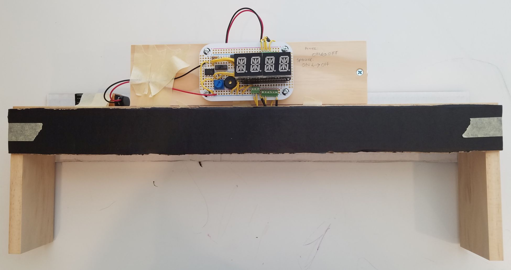

**ESP8266 Pinewood Derby Timer**

Build an affordable WiFi-controlled Pinewood Derby timer for your Cub Scout or Boy Scout pack! Use the optional windows race software or connect directly to the derby timer webserver over WiFi.

Hardware Requirements:
* ESP8266 development board (Adafruit Feather Huzzah)
* Adafruit Feather LED Alphanumeric Display (I2C)
* Infrared breakbeam sensors
* Proto board (Adafruit Tin sized board)
* Wire block terminals (Adafruit 2.54mm x.1mm terminal blocks)
* Piezo (3v+)

Software Requirements:
* Arduino IDE
* Arduino ESP8266 board configuration
* Adafruit LEDBackpack, GFX libraries
* Derby_timer sketch 

**Uploading Switch**  
1. Pin 2 to piezo leg a  
2. Piezo leg b to switch1 pole left/right  
3. Switch1 pole center to ground  

**Power Switch**  
1. EN pin to switch2 pole left/right  
2. Switch2 pole center to ground  

**Inputs**  
1. Pin 14 to micro switch to ground  
2. Pin 12 to micro switch to ground  
3. Pin 13 to micro switch to ground  
4. Pin 15 to micro switch to 3v3  
