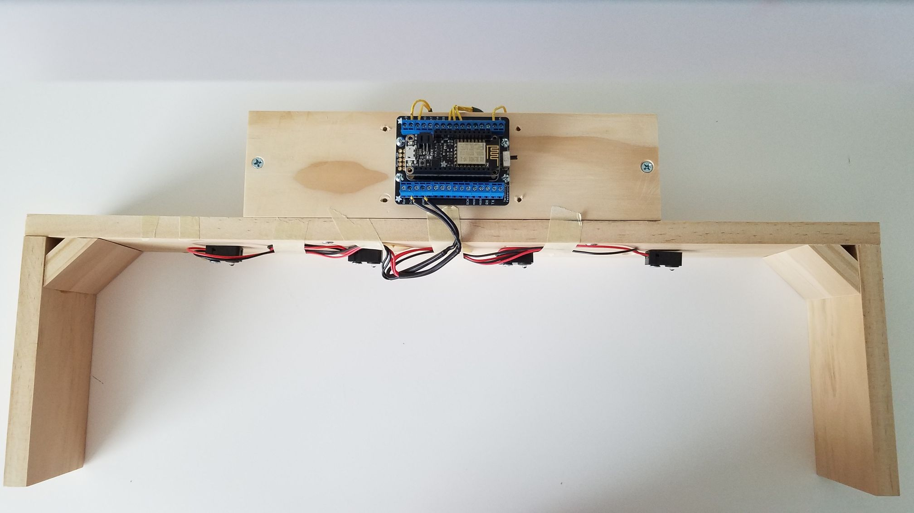
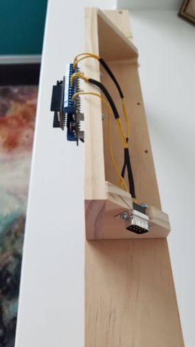
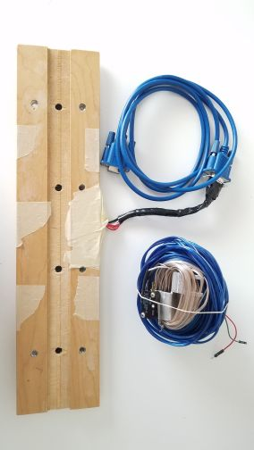
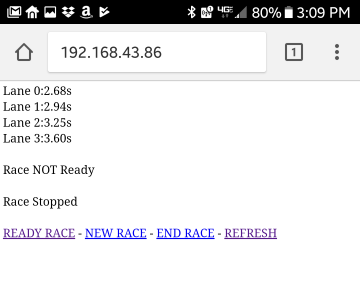
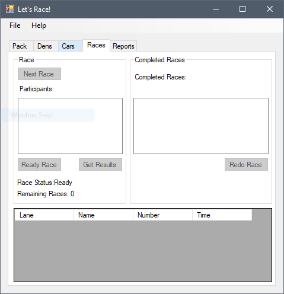

# ESP8266 Pinewood Derby Timer #

Build an affordable WiFi-controlled Pinewood Derby timer for your Cub Scout or Boy Scout pack! Use the optional windows race software or connect directly to the derby timer webserver over WiFi.

 

Hardware Requirements:
* Adafruit ESP8266 Feather Huzzah
* Adafruit TermBlock FeatherWing
* IR break beam sensor (qty 4)
* DB9 serial cable (male/male)
* DB9 serial female jack (qty 2) 
* Micro game switch with lever
* Plenty of wire, solder, shrink tubing!
* Wood

Software Requirements:
* Arduino IDE
* Arduino ESP8266 board configuration
* Derby_timer sketch 

## Race Platform ##

You will need to build a simple platform for mounting electronics to. I used 1x3 poplar boards, screws and a miter saw. The race platform I created covers 4 lanes (20" long and 8" tall.) You should place the IR emiters under the platform so that they shine down on the track. I created a matching baseplate for mounting the IR break sensors underneath the track (the track must have coresponding holes for the sensors.) If the platform is too tall, the IR break beam sensors might not work reliably. 

When mounting electronics I used plastic standoffs and small screw and bolts. You need to be careful not to cause an electrical short.

 

## Electronics ##

I recommend using the Adafruit ESP8266 Feather Huzzah development board and matching TermBlock FeatherWing. With this combination you can securely wire the project and reuse the electronics in the future.

Mount the IR emitters and pigtail the positive and negative connections to 3v and GND terminals. Be sure to solder the pigtail and use shrink tubing :)

Create a wire harness using a DB9 female jack a lead for GND, a lead for 3v and a lead for each IR sensor. You will need to carefully solder the wire jack pins with helping hands. Be sure to use a continuity tester to check the pin out of your serial cable! Connect the wire harness to the terminal block - I used pins 14, 12, 13, 5 for the IR lane sensors.

Create a matching wire harness for connecting the IR break beam sensors. Pigtail and solder the 3v and GND leads from the sensors and connect the output from each sensor to the DB9 female jack.

Wire a simple micro switch sensor to GND and pin 4/SDA (an internal pullup resistor will be used in the sketch.) In the sketch you can set the pin interrupt to either rising or falling to match whether your switch is normally opened or closed. The switch will be mounted to your track race starter.

## Software ##

You must upload the `derby_timer.ino` Arduino sketch to the ESP8266. You need to provide a wifi SSID and password before uploading. I like to use my cellphone hotspot.

When the ESP8266 is turned on it will connect to your access point and obtain a DHCP address. You can then use your web browser to access the built in timer page.

Press the `READY RACE` button to arm the timer. The status LED will turn to BLUE. When the race starter switch is triggered the timer will start and status LED will turn to RED. When all cars pass the finish line the LED will be dark. Press the `REFRESH` button to view the results. You can also use the `NEW RACE` and `END RACE` buttons to start and stop the race without using the starter switch or waiting for all cars to pass the finish line.

 

You can also use the [Let's Race](https://github.com/jgalentine007/esp8266_derby_app) app that I created! The app will let you add racers tabulate and report the winner of each race and the overall derby :)

